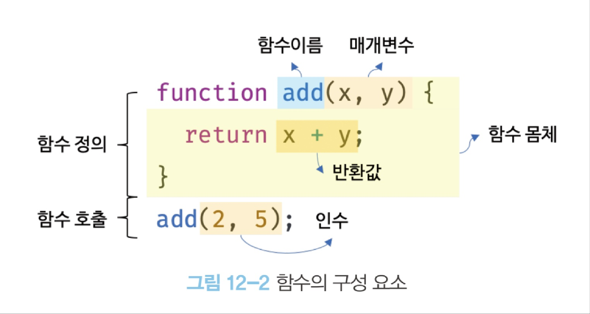
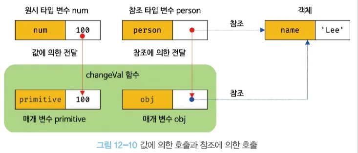

# 12장 함수

# 함수

## 함수의 개념

입력을 받아, 특정 행동을 한 뒤 출력하는 과정

## 함수의 구성



## 함수 리터럴

- JS에서 함수는 객체 타입의 값 → 함수 리터럴로 정의 가능
- 이때 함수 리터럴의 함수 이름은 함수 몸체 내에서만 참조 가능한 식별자
    - 즉 외부에서 add를 호출하려고 해도 안됨

```jsx
var f = function add(x, y) {
	return x + y;
}
```

## 함수 정의

### 함수 선언문

- 함수 이름 생략 불가능
- 표현식이 아닌 문 → 함수 선언문을 실행하면 완료 값으로 undefined가 출력
- 위에 나온 예시처럼, 이러한 방식은 함수 선언문이지만 문맥에 따라 함수 리터럴 표현식으로도 취급됨
    - 위 예시는 피연산자로 취급되면 함수 리터럴 표현식으로 취급
- JS엔진은 함수 선언문에 대한 식별자를 함수 이름과 동일하게 임의로 생성
    - 그렇기에 별다른 리터럴 선언없이도 접근 가능

```jsx
function add(x, y) {
	return x + y;
}
```

- 함수 호이스팅
    - 변수 호이스팅처럼, 함수 선언문으로 선언된 함수는 호이스팅이 진행된다
    - 초기값인 undefined로 초기화된 변수 호이스팅과 달리, 함수 호이스팅은 선언문 이전에 초기화 가능
    - 사실 호이스팅의 개념은 선언에 한정되어서 진행되기에 이러한 차이가 나오는것으로 보임

```jsx
console.dir(add); // f add(x, y)
console.dir(sub); // undefined

console.log(add(2, 5)); // 7
console.log(sub(2, 5)); // TypeError

function add(x, y) {
	return x + y;
}

var sub = function (x, y) { // 이건 변수 호이스팅
	return x - y;
};
```

### 함수 표현식

- JS에서의 일급객체
    - 일급객체는 간단히 말해 값의 성질을 갖는 객체

```jsx
var add = function(x, y) {
	return x + y;
};
```

### Function 생성자 함수

- 일반적이지도 않고, 바람직하지도 않음
- Closure를 생성하지 않음 → 다르게 동작함

```jsx
var add = new Function('x', 'y', 'return x + y');
```

### 화살표 함수

- 항상 익명 함수로 정의함
- 생성자 함수로 사용할 수 없음
- 기존 함수와 this 바인딩이 다름
- prototype property가 없음
- arguments 객체를 생성하지 않음 → 이후 26장에서 다룸

```jsx
var add = (x, y) => x + y;
```

## 함수 호출

### 매개변수와 인수

- 함수 호출시
    - 함수 몸체 내에서 암묵적으로 매개변수 생성
    - 이후 undefined로 초기화 후 인수가 순서대로 할당됨
    - 만약 인수가 부족하면 매개변수에 할당이 안되기에 undefined가 됨
    - 인수가 초과되면 암묵적으로 arguments 객체의 프로퍼티로 보관됨
- 매개변수는 최대한 적게끔, 함수는 한가지 일만 하게끔 만드는것이 이상적

```jsx
function add(x, y){
	console.log(x, y);
	return x + y;
}

add(2); // y는 undefined가 됨

add(2, 5, 10);
// Arguments(3) [2, 5, 10, callee: f, Symbol(Symbol.iterator): f]
```

### 인수 확인

- JS는 인수에 대한 타입 검증을 하지 않기에, 원하지 않은 방향으로 사용될 수 있음
- 단축 평가, 타입 체크, 타입 스크립트와 같은 확장 적용으로 체크를 하는게 바람직

### 매개변수 기본값 (ES6 ~ )

- 인수가 전달되지 않으면, 해당 값으로 초기화가 됨

```jsx
function add(x = 0, y = 0){
	return x + y;
}

add(2); // 2
```

### 반환문

- return 키워드로 반환됨
- 함수의 실행을 중단하고 함수 몸체를 빠져나감
- return 뒤의 표현식을 평가해 반환, 아무것도 없으면 undefined 반환
- return 위에 아무것도 없이 개행문자오면 세미콜론 자동 삽입됨

```jsx
function multiply(x, y) {
	return // 세미콜론 자동 삽입 <- 이거 말안됨
	x * y; // 무시됨
}
```

## 참조의 의한 전달 (call by reference)

- 기본적으로 원시 타입 인수는 immutable하기에 재할당(깊은 복사)를 통해 해당 값이 전달
- 객체는 얕은 복사를 통해 참조 값이 전달됨 → 함수 내부에서 변경 시, 외부에서도 변경됨
    - 만약 외부 상태를 변경하고 싶지 않다면, immutable object로 만드는 방법이 있음



## 다양한 함수의 형태

### 즉시 실행 함수

- 함수 정의와 동시에 즉시 호출되는 함수
- 보통은 익명 함수로 정의
    - 어차피 이름이 있어도 함수 몸체에서밖에 사용 불가
- 궁금한점 :  this용법
- 그룹 연산자로 감싸야 **함수 리터럴로** 인식되어 에러가 안남

```jsx
(function (){
	var a = 3;
	var b = 5;
	return a * b;
}());
```

### 재귀 함수

- 함수 몸체 내부에서 자기 자신을 호출하는 함수
- 무한정 실행 가능하므로 탈출 조건을 달아줘야함
- 함수 실행시 할당된 식별자로도 재귀 가능

```jsx
var factorial = function foo(n) {

	if (n <= 1) return 1;
	return n * factorial(n - 1);
	
	// return n * foo(n - 1); 
}
```

### 중첩 함수

- 함수 내부에 정의된 함수
- 외부 함수에서만 내부 함수를 호출 가능함
- ES6부터 함수 정의는 아무 위치가 가능
- 호이스팅으로 인한 혼란을 피하기 위해 if문이나 for문 등에는 선언하지 않기

```jsx
function outer() {
	var x = 1;
	function inner() {
		var y = 2;
		console.log(x + y);
	}
	inner();
}

outer();
```

### 콜백 함수

- 함수의 매개변수를 통해 다른 함수의 내부로 전달되는 함수
    - 고차함수: 매개변수를 통해 함수의 외부에서 콜백 함수를 전달받은 함수

```jsx
function repeat(n, f) { // 고차 함수
	for (var i = 0; i < n; i++) {
		f(i);
	}
}
var logAll = function (i) { // 콜백 함수
	console.log(i);
};
repeat(5, logAll);
```

- 익명 함수 리터럴로 콜백 함수를 전달 가능하다
    - 단 실행시마다 평가를 통해 함수 객체가 생성되므로, 많이 반복되는 콜백 함수는 외부에서 정의하고 전달하는게 효율적이다

```jsx
repeat(5, function(i) {
	if(i % 2) console.log(i);
});
```

- 배열 고차 함수에서도 사용 가능

```jsx
var res = [1, 2, 3].map(function (item) {
	return item * 2;
});
```

### 순수 함수와 비순수 함수

- 순수 함수: 외부 상태에 의존하지도 않고 변경하지도 않는 함수
    - 매개변수를 통해 전달받은 인수에게만 의존해 값을 생성 후 반환

```jsx
function increase(n){
	return ++n;
}
var count = 0;
count = increase(count);
```

- 비순수 함수: 외부 상태에 의존하거나 외부 상태를 변경하는 함수

```jsx
var count = 0;

function increase(){
	return ++count;
}

increase();
```