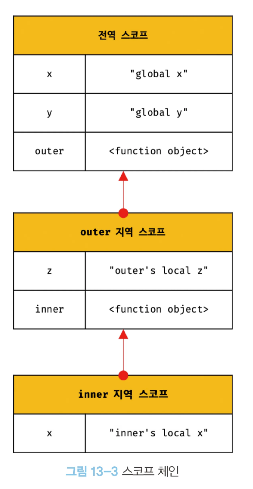

# 13장 스코프

# 스코프

<aside>
💡

식별자가 선언된 위치에 의해 다른 코드가 식별자 자신을 참조할 수 있는 유효범

</aside>

- JS 엔진은 스코프를 통해 어떠한 변수를 참조해야할지 결정함 (식별자 결정)
    - 그렇기에, 같은 스코프 내에 같은 이름의 식별자는 사용 불가
    - 근데 var키워드는 가능함 (?) → 이때는 이전 선언문이 덮어씌워짐

# 스코프의 종류

## 전역과 전역 스코프

- 코드의 가장 바깥 영역
- 전역 변수는 어디서든 참조가능하다

## 지역과 지역 스코프

- 함수 몸체 내부
- 지역 변수는 자신의 지역 스코프와 “하위 지역 스코프”에서 유효

## 스코프 체인

- 함수는 중첩이 가능하다 → 계층적 구조를 가질 수 있음
    - 중첩 함수: 함수 몸체 내부에서 정의한 함수
    - 외부 함수: 중첩 함수를 포함하는 함수
- 스코프도 계층적 연결이 가능하다 → 스코프 체인

### 변수 검색 및 함수 검색

- 변수를 참조할때 스코프 체인을 통해 변수를 참조하는 코드의 스코프에서 시작하여 상위 스코프로 탐색
- 함수 검색도 동일하게 진행됨



## 함수 레벨 스코프

- 다른 언언들은 모든 코드 블록이 지역 스코프를 만듬 → 블록 레벨 스코프
- var는 함수 레벨 스코프만 인정함 (왜?)
- let과 const는 블록 레벨 스코프를 지원

```jsx
var x = 1;
if(true){
	var x = 10;
}
console.log(x); // 10
```

```jsx
var i = 10;

for (var i = 0; i < 5; i++){
	console.log(i); // 0 1 2 3 4
}

console.log(i); // 5
```

## 렉시컬 스코프

```jsx
var x = 1;
function foo() {
	var x = 10;
	bar();
}

function bar() {
	console.log(x); // 1
}
foo(); // 1
bar(); // 1
```

- 동적 스코프
    - 함수를 어디서 호출했는지에 따라 함수의 상위 스코프를 결정
- 정적 스코프, 렉시컬 스코프
    - 함수를 어디서 정의했는지에 따라 함수의 상위 스코프를 결정 ← JS의 방식