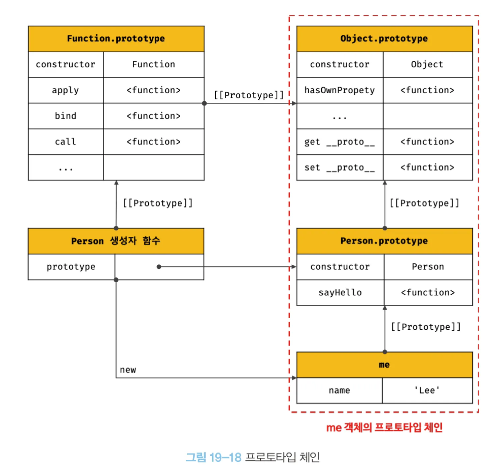
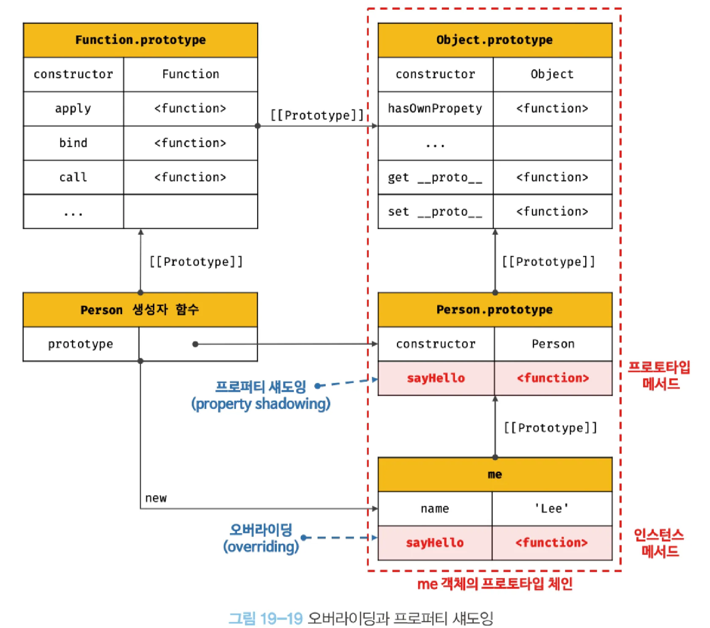
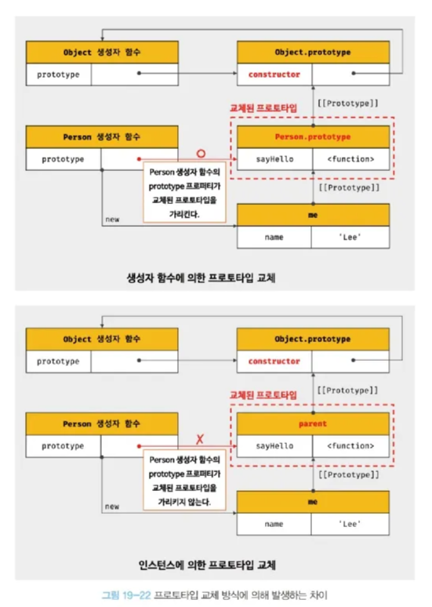

# 19장 프로토타입 (19.7 ~ )

# 프로토타입 체인

---



<aside>
💡

객체의 프로퍼티에 접근하려고 할 때, 해당 객체에 접근하려는 프로퍼티가 존재하지 않으면 내부 슬롯의 참조에 따라 부모 프로퍼티를 검색하는것

</aside>

- JS의 상속을 구현하는 매커니즘
- Object.prototype은 프로토타입 체인의 종점 → 만약 Object.prototype에서도 찾지 못하면 undefined

# 오버라이딩과 프로퍼티 섀도잉

---



- 오버라이딩: 생성된 인스턴스에 대하여, 인스턴스의 프로퍼티에서 프로토타입 매서드를 덮어 씀
- 프로퍼티 섀도잉: 오버라이딩으로 인해 프로토타입의 프로퍼티가 가져리는 것
- 프로토타입 체인을 통해 하위 객체로 프로토타입 프로퍼티의 수정이나 삭제가 불가능 (get만 가능)

```jsx
delete me.sayHello;

me.sayHello(); // 프로토타입의 매서드 호출됨
```

# 프로토타입의 교체

---

## 생성자 함수에 의한 프로토타입의 교체

---

- 프로토타입을 교체하게 되면 프로토타입의 contructor 프로퍼티 값이 사라지게 된다
    - 이를 생성자에서 이어주어야함

```jsx
const Person = (function () {
	function Person(name) {
		this.name = name;
	}
	
	// 생성자의 prototype 프로퍼티
	Person.prototype = {
		constructor: Person,
		sayHello () {
			
		}
	}
	return Person;
}());
```

## 인스턴스에 의한 프로토타입의 교체

---

- 인스턴스의 프로토타입을 덮어쓰게될 경우 → 해당 인스턴스만 적용됨
- 생성자의 프로토타입과 괴리가 오게되므로 이를 설정해줘야함



결과적으로 프로퍼티를 직접 설정해주면 문제가 많으므로, 이후 나오는 직접 상속을 사용하자

# instanceof 연산자

---

- 생성자 함수의 prototype에 바인딩된 객체가 좌변의 프로토타입 체인 상에 존재하면 true

```jsx
function Person(name) {
	this.name = name;
}

const me = new Person('Lee');

const parent = {};

Object.setPrototypeOf(me, parent);

console.log(Person.prototype === parent); // false
console.log(parent.constructor === Person); // false

console.log(me.constructor === Person); // false
console.log(me.constructor === Object); // true
```

# 직접 상속

---

### Object.create에 의한 직접 상속

---

- Object.create
    - 명시적으로 프로토타입을 지정하여 새로운 객체를 생성

```jsx
obj = Object.create(Object.prototype, {
	x: { value : 1, writable: true, enumerable: true, configurable: true }
});

console.log(obj.x) // 1
console.log(Object.getPrototypeOf(obj) === Object.prototype); // true
```

## 객체 리터럴 내부에서 __proto__에 의한 직접 상속

---

- ES6 부터 객체 리터럴 내부에서 __proto__ 설정 가능

```jsx
// ES6
const myProto = { x: 10 };

const obj = {
	y: 20,
	__proto__: myProto
}

console.log(Object.getPrototypeOf(obj) == myProto); // true
```

# 정적 프로퍼티 메서드

---

- 생성자 함수로 인스턴스를 생성하지 않아도 참조/호출할 수 있는 프로퍼티, 메서드
- 사실상 생성자 함수 객체에 프로퍼티 추가하는거
    - 즉 프로토타입에 없음

```jsx
function Person(name) {
	this.name = name;
}

Person.a = function () {
	console.log('static method');
};

Person.a();
```

# 프로퍼티 존재 확인

---

## in 연산자

---

- 객체 내에서 특정 프로퍼티가 존재하는지 여부 반환

```jsx
const person = {
	name: 'Lee',
	address: 'Seoul'
}

console.log('name' in person); // true
console.log('age' in person); // false
console.log('toString' in person); // true, 프로토타입 체인에서도 찾음

console.log(Reflect.has(person, 'name')); // true
console.log(Reflect.has(person, 'age')); // false, in과 동일하게 작동

console.log(person.hasOwnProperty('name')); // true
console.log(person.hasOwnProperty('toString')); // false
```

# 프로퍼티 열거

---

## for … in 문

---

- 객체의 모든 프로퍼티를 순회하면서 열거
- 프로토타입 체인 내의 모든 [[Enumerable]]이 true인 녀석들에 대해 순회
    - Object.prototype.toString은 false라 안나옴
- 직계 프로퍼티인지 보고싶으면 Object.prototype.hasOwnProperty(key) 사용하기
- 순서는 보장하지 않음{

```jsx
const arr = [1, 2, 3];
arr.x = 10; // 배열도 객체이므로 프로퍼티 가질 수 있음

for (const i in arr){
	// 프로퍼티 x도 출력됨
	// 1 2 3 10
}

// length는 3
for (let i = 0; i < arr.length; i++) {
	// 1 2 3
}

// forEach는 요소만 뽑아냄
arr.forEach(v => console.log(v)); // 1 2 3
```

## Object.keys / values / entries 메서드

---

- Object.keys: 자신의 열거가능한 프로퍼티 키를 배열로 반환
- Object.values: 자신의 열거가능한 프로퍼티 값을 배열로 반환
- Object.entries: 객체 자신의 열거 가능한 프로퍼티 키와 값의 쌍의 배열을 배열로 만들어 내보냄

```jsx
const Person = {
	name: 'Lee',
	address: 'Seoul',
	__proto__: { age: 20 }
}

console.log(Object.keys(person));
// ["name", "address"]
console.log(Object.values(person));
// ["Lee", "Seoul"]
console.log(Object.entries(person));
// [["name", "Lee"], ["address", "Seoul"]]
```