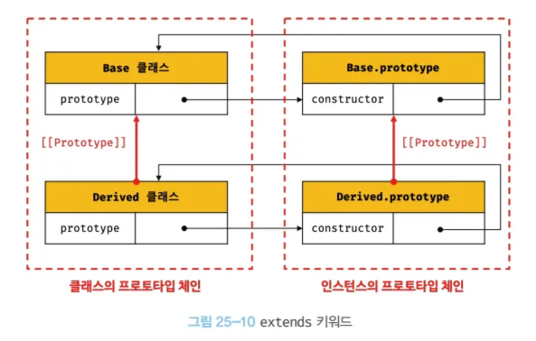

# 25장 클래스

# 메서드

---

## constructor method

<aside>
💡

인스턴스를 생성하고 초기화하기 위한 특수한 메서드

</aside>

### 선언 방식

```jsx
class Person {
  constructor(name) {
    this.name = name;
  }
}
```

- class도 생성자 함수 취급이기에 prototype property의 constructor는 해당 class가 된다
- prototype method와 다르게 생성된 인스턴스는 contructor method를 들고있지 않다.
- 여러개 쓰면? → syntax error
- 아예 안쓰면? → 기본 constructor( ) { } 생성
- this 바인딩
  - 해당 클래스로 생성할 새로운 인스턴스가 바인딩 된다.
- 반환값으로 객체를 주면, this가 아닌 해당 객체가 반환된다.

```jsx
class Person {
  constructor(name) {
    this.name = name;
    return {};
  }
}
const me = new Person("Lee");
console.log(me); // {}
```

## prototype method

<aside>
💡

prototype에 추가하는 메서드

</aside>

- 생성자 함수는 prototype에 직접 메서드를 추가해야함
- class의 경우 몸체에 일반적으로 정의한 메서드가 자동으로 추가됨

```jsx
class Person {
  constructor(name) {
    this.name = name;
  }

  sayHi() {
    console.log(`Hi! ${this.name}`);
  }
}

const me = new Person("Lee");
me.sayHi();
```

- this 바인딩
  - 호출한 객체이기에 대부분의 경우 인스턴스가 됨

## static method

<aside>
💡

함수 자체에에 추가될 정적 메서드

</aside>

### 선언방식

```jsx
class Person {
  constructor(name) {
    this.name = name;
  }

  static sayHi() {
    console.log(`Hi!`);
  }
}
Person.sayHi(); // Hi!
```

- class에 추가되는 메서드기에, class를 이용해서 호출해야 한다
- this 바인딩
  - 정적 메서드는 class를 이용하여 접근하기에 호출한 객체인 class 자체가 바인딩됨

## 클래스에서 정의한 메서드의 공통 특징

1. function 키워드를 생략하고 사용한다
2. 객체 리터럴과 다르게 ( , )가 필요없다
3. 암묵적으로 strict mode로 실행된다
4. 프로퍼티 어트리뷰트인 [[Enumerable]]이 false기 때문에 열거가 불가능하다.
5. 내부 메서드 [[Construct]]가 없기 때문에 new를 이용한 생성자로 쓸 수 없다

## 클래스의 인스턴스 생성 과정

1. 인스턴스 생성과 this 바인딩
2. 인스턴스 초기화
3. 인스턴스 반환

# 프로퍼티

---

## 인스턴스 프로퍼티

- constructor 내부에서 정의한 프로퍼티만이 인스턴스의 프로퍼티가 된다
- 접근 제한자가 딱히 없기에, public하게 어디서든 접근 가능하다.

```jsx
class Person {
  constructor(name) {
    this.name = name; // 이건 새로 생성되는 인스턴스에 추가됨
  }

  sayHi() {
    // 이건 prototype꺼
    console.log(`Hi! ${this.name}`);
  }
}
```

## 접근자 프로퍼티

- class에서도 접근자 프로퍼티를 쓸 수 있으나, 인스턴스에 넣는건 일반적이지 않다 (this만으로 넣기 힘듬)
- 프로토타입에 접근자 프로퍼티를 추가해서 쓴다

### 선언 방식

```jsx
class Person {
	constructor(firstName, lastName) {
		this.firstName = firstName;
		this.lastName = lastName;
	}

	get fullName() { // 이건 prototype 꺼
		return `${this.firstName} ${this.lastName}`;
	}

	set fullName() { // 이거도 prototype꺼
		[this.firstName, this.lastName] = name.split(' ');
	}
}

const me = new Person('aaa', 'K');
console.log(me.fullName); // SG K
me.fullName = 'aaa aa'
console.log(me.fullName); // aaa aa
```

## 클래스 필드 정의 (아직 stage 3)

- 일반적인 인스턴스의 프로퍼티를 등록하려면 constructor에서 진행해야함
- 새로운 기능! 클래스 필드에서 정의하자

```jsx
class Person {
  name = "Lee";
}
const me = new Person();
console.log(me.name); // Lee
```

## private 필드 정의 (아직 stage 3)

- JS는 접근 제한자가 존재하지 않다 → 그래도 private으로 쓰고싶다
- #을 앞에 붙여서 선언 → 외부에서 접근 불가

```jsx
class Person {
  #name = "";
  constructor(name) {
    this.#name = name;
  }

  get name() {
    return this.#name.trim();
  }
}
const me = new Person("Lee");
console.log(me.#name); // 접근 불가
console.log(me.name); // Lee
```

- 접근자 프로퍼티를 이용한 접근은 가능 → 내부로 접근하는거라서

## static 필드 정의 (아직 stage 3)

- static 키워드를 이용하여 정적 필드 선언 가능

# 상속에 의한 클래스 확장

---

## Extends 키워드

```jsx
class Base {}
class Derived extends Base {}
```

- 상속을 하기 위해서 쓰는 키워드
- 상속을 통해 확장된 클래스를 서브클래스, 상속된 클래스를 수퍼클래스라고 부른다.
- 상속을 통해 확장하면, 클래스와 해당 클래스의 prototype 모두 체인에 들어간다



## 동적 상속

- 생성자 함수를 상속받을 수 있다 (클래스도 함수!)

```jsx
function Base(a) {
  this.a = a;
}
class Derived extends Base {}
const derived = new Derived(1);
console.log(derived.a); // 1
```

- 동적으로 상속받을 객체를 정할 수 있다

```jsx
class Derived extends (condition ? Base1 : Base2) {}
```

## 서브클래스의 constructor & super 키워드

- 서브 클래스의 생성자는 자동적으로 수퍼 클래스의 생성자를 사용하여 인스턴스를 생성하게 된다.

```jsx
class Derived extends Base {
  // constructor(...args) { super(...args); }
}
```

- super 키워드를 이용하면 서브 클래스의 생성자에서 부모 클래스의 생성자를 사용 가능하다.
- 안쓰면 에러가 뜬다 (필수임)
- super를 쓰기 전까지 this를 참조 할 수 없다
- 생성자에서만 super를 호출할 수 있고, 다른 곳에서는 에러가 뜬다

```jsx
class Derived extends Base {
  constructor(a, b, c) {
    super(a, b);
    this.c = c;
  }
}
```

- super를 참조하면 수퍼클래스의 메서드를 호출할 수 있다.
- 자동적으로 호출한 인스턴스로 this가 바인딩된다.
- [[HomeObject]] : 메서드 자신을 바인당하고 있는 객체를 의미

```jsx
class Base {
  constructor(name) {
    this.name = name;
  }

  sayHi() {
    return `Hi ${this.name}`;
  }
}

class Derived extends Base {
  sayHi() {
    return `${super.sayHi()}`;
  }
}
```

- ES6에서 정의된 메서드 축약 표현 함수에서도 super가 호출 가능하다 (function 키워드 안쓰는거)

## 상속 클래스의 인스턴스 생성 과정

1. 서브 클래스의 super 호출
   - 상속 받는 클래스의 경우 내부 슬롯 [[ConstructorKind]]가 derived로 설정되어있다 (기본은 base)
   - 이를 통해 인스턴스 생성 과정에서 차이를 둔다
     - 서브 클래스의 경우 super 클래스에게 인스턴스 생성을 위임한다
2. 수퍼 클래스의 인스턴스 생성과 this 바인딩
   - new.target을 호출하면 new 키워드를 이용하는 클래스가 바인딩되어있다.
3. 수퍼 클래스의 인스턴스 초기화
   - 수퍼 클래스의 생성자를 이용하여 인스턴스를 초기화한다
4. 서브 클래스의 constructor로의 복귀와 this 바인딩
   - 서브 클래스의 constructor로 돌아오며 생성한 인스턴스를 this에 바인딩한다
5. 서브 클래스의 인스턴스 초기화
6. 인스턴스 반환

## 표준 빌트인 생성자 함수 확장

- 생성자 함수로써 쓰이는 모든 함수를 확장에 사용 가능하다
  - ex) Array
- 그러면 상속할 생성자 함수의 프로토타입 체인에 있는 요소들을 사용 가능하다

```jsx
class MyArray extends Array {}
const myArray = new MyArray(1, 1, 2, 3);
console.log(
  myArray
    .filter((v) => v % 2)
    .unique()
    .average()
);
```

- 만약 MyArray가 아닌 상속받은 Array로 반환하고 싶으면 Symbol.species를 쓰면된다

```jsx
class MyArray extends Array {
  static get [Symbol.species]() {
    return Array;
  }
}
```
